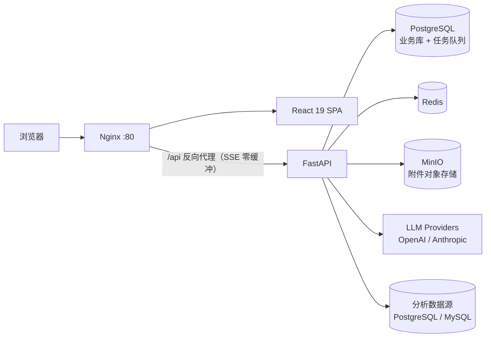

# DataPilotAgent

[](LICENSE)
[](backend/requirements.txt)
[](https://fastapi.tiangolo.com/)
[](frontend/package.json)
[](frontend/tsconfig.json)

**AI 驱动的智能数据分析平台** —— 通过自然语言对话完成数据查询、分析、可视化与洞察提取。

DataPilotAgent 将「用一句话提问」转化为「可回溯的分析结果」：LLM Agent 自动生成并执行 SQL、在沙箱中运行 Python 分析、渲染交互式图表，每一步的 SQL、数据来源全程可查，支持一键收藏到看板并导出 PNG / SVG / PDF。

## 功能特性

- **自然语言对话分析**：SSE 流式响应，文本 / SQL / 表格 / 图表以 Block 结构分块渲染，支持中断与多会话管理
- **多 LLM 提供商**：OpenAI / Anthropic 双协议适配器，多 Provider 可配置；基于模型上下文窗口的对话历史自动压缩
- **多数据源管理**：PostgreSQL / MySQL 连接测试、Schema 预览、连接密钥 Fernet 加密存储、返回掩码
- **附件数据分析**：Excel / CSV 上传至 MinIO，Worker 内 pandas 解析，作为会话级临时数据源参与问答
- **图表与看板**：柱状 / 折线 / 饼图等交互式图表，收藏看板，图表级 PNG / SVG / PDF 导出
- **Agent 工具链**：`run_sql` / `run_python`（RestrictedPython 沙箱）/ `create_chart` / `request_confirmation`，敏感操作需人工确认
- **报表与模板**：定时报表任务（任务队列调度）、分析模板沉淀复用、数据源快捷提问文案
- **可观测性**：structlog 五类日志（system / application / ai / error / audit）入库可查询，LLM Token 用量统计
- **轻量任务队列**：基于 PostgreSQL `FOR UPDATE SKIP LOCKED` 的队列与 Worker，无额外中间件依赖

## 架构与技术栈



| 层 | 技术 |
|---|---|
| 后端 | Python 3.11+ · FastAPI · SQLAlchemy 2.0（async）· Alembic · Pydantic v2 · structlog · pandas |
| LLM | OpenAI SDK · Anthropic SDK · tiktoken（上下文预算估算） |
| 前端 | React 19 · TypeScript（strict）· Vite · Tailwind CSS v4 · Zustand · Recharts · Monaco Editor |
| 基础设施 | PostgreSQL（业务 + 队列）· Redis · MinIO · Nginx |

## 快速开始

### 环境要求

- Python 3.11+
- Node.js 20+ 与 [pnpm](https://pnpm.io/) 9+
- PostgreSQL 14+ / Redis 6+ / MinIO 实例（自建、云托管，或用 Docker 本地拉起，见下文）

### 1. 配置环境变量

```bash
cp .env.example .env
```

[`.env.example`](.env.example) 包含全部变量与注释。没有现成的基础设施？用 Docker 一键拉起本地 PostgreSQL / Redis / MinIO（数据持久化在 Docker 卷中）：

```bash
docker compose -f docker-compose.infra.yml up -d
```

模板中的默认值与该编排对齐，本地起步无需改动即可连通；使用远程实例时，将 `.env` 中的连接信息替换为实际地址即可。

### 2. 启动后端

```bash
cd backend
python3 -m venv venv && source venv/bin/activate
pip install -r requirements.txt
uvicorn app.main:app --reload --port 8010
```

- 首次启动自动建表并初始化：默认管理员 `admin / Admin@12345`、默认系统配置、MinIO bucket
- 接口文档：<http://localhost:8010/docs>
- 生产环境请改用 Alembic 迁移，并显式设置 `SECRET_KEY` 与 `ENCRYPTION_KEY`

### 3. 启动前端

```bash
cd frontend
pnpm install
pnpm dev
```

访问 <http://localhost:5173>（开发服务器已将 `/api` 代理到 `:8010`），使用默认账号登录。

## Docker Compose 部署

应用层一键部署（PostgreSQL / Redis / MinIO 仍使用 `.env` 中的远程实例）：

```bash
docker compose up -d --build
```

Nginx 监听 80 端口：托管前端静态资源，并将 `/api/` 反向代理到后端（SSE 已关闭缓冲）。

> 注意：后端容器内的 `127.0.0.1` 指向容器自身。若基础设施跑在本机（如 `docker-compose.infra.yml` 拉起的实例），请将 `.env` 中的 host 改为 `host.docker.internal`（Docker Desktop）或宿主机局域网 IP。

> 生产部署必须设置强随机的 `SECRET_KEY`，并显式提供 `ENCRYPTION_KEY`（用于数据源密码等敏感字段的 Fernet 加密）。

## 环境变量说明

全部变量及默认值见 [`.env.example`](.env.example)，主要变量速查：

| 变量 | 说明 |
|---|---|
| `PG_*` / `DATABASE_URL` | PostgreSQL 连接（业务数据 + 任务队列） |
| `REDIS_*` / `REDIS_URL` | Redis 连接 |
| `MINIO_*` | MinIO 端点与凭证（附件存储） |
| `SECRET_KEY` | JWT 签名密钥，生产必须更换 |
| `ENCRYPTION_KEY` | Fernet 密钥（`enc:` 前缀密文）；未设置时开发模式自动生成并持久化到 `data/` |
| `ENABLE_AUTH` | 是否启用认证（默认 `true`） |
| `CORS_ORIGINS` | CORS 白名单，禁止使用 `*` |
| `VITE_API_BASE` | 前端 API 前缀（开发默认 `/api`，走 Vite 代理） |
| `VITE_USE_MOCK` | 前端 Mock 开关（默认 `false`） |

## 目录结构

```
.
├── backend/
│   ├── app/
│   │   ├── api/          # HTTP 路由层（薄，参数校验 + 响应包装）
│   │   ├── services/     # 业务逻辑层（Chat / Data / Task / Export ...）
│   │   ├── models/       # SQLAlchemy 2.0 ORM 模型
│   │   ├── schemas/      # Pydantic v2 请求 / 响应 DTO
│   │   ├── core/         # 配置 / 数据库 / 安全
│   │   ├── llm/          # LLM 适配器（OpenAI / Anthropic）与 Token 估算
│   │   ├── agents/       # Agent 工具集（run_sql / run_python / create_chart）
│   │   ├── tasks/        # 任务队列（SKIP LOCKED）与 Worker
│   │   └── utils/
│   └── alembic/          # 数据库迁移
├── frontend/
│   └── src/
│       ├── routers/      # 路由表与布局守卫
│       ├── components/   # 按 area 分组的组件（chat / datasource / config ...）
│       ├── store/        # Zustand 状态
│       ├── hooks/        # 复用逻辑（useChat / useSSE / useAttachments ...）
│       ├── lib/          # API 客户端 / SSE 客户端
│       └── types/        # 前后端共享契约类型
├── docs/                 # 需求 PRD / 技术方案 / Block 协议 / UI 规范
└── docker-compose.yml    # 应用层部署编排
```

## 设计文档

深入了解协议与设计，请阅读 `docs/` 下的契约文档（实现准绳，冲突时按序裁决）：

| 文档 | 内容 |
|---|---|
| [`docs/需求PRD.md`](docs/需求PRD.md) | 功能范围与验收口径 |
| [`docs/技术方案设计.md`](docs/技术方案设计.md) | 架构、DDL、API 一览、任务队列、安全设计 |
| [`docs/Block与协议规范.md`](docs/Block与协议规范.md) | Block 结构 / SSE 事件 / LLM 工具协议 |
| [`docs/UI设计规范.md`](docs/UI设计规范.md) | 设计 token 与组件规范 |

## 安全设计

- 认证采用 JWT（Bearer）+ bcrypt 密码哈希；登录接口按 IP 限流
- 数据源密码、LLM API Key 等敏感字段入库前经 Fernet 加密（`enc:` 前缀），对外一律返回掩码
- 所有按 ID 的资源访问强制校验归属，杜绝越权
- SQL 执行只读约束 + Python 沙箱（RestrictedPython），危险操作需人工确认
- 请勿将 `.env`、加密密钥提交到仓库或写入日志

## 贡献

欢迎 Issue 与 PR。提交前请确保：

```bash
# 前端三关（类型 / lint / 构建）
cd frontend && pnpm exec tsc -b && pnpm exec oxlint src && pnpm run build
```

## License

本项目基于 [MIT License](LICENSE) 开源。
